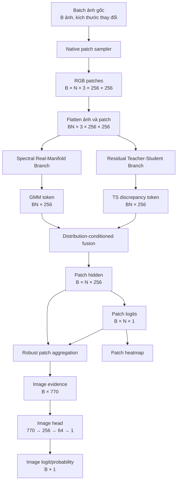
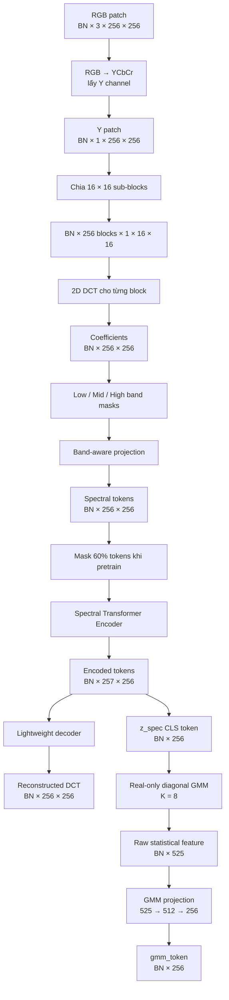
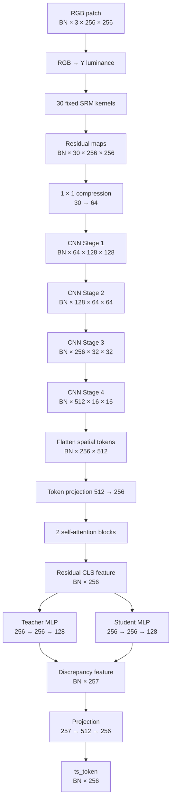

# D2-FAD — Detailed Architecture and Tensor Shapes

Tài liệu này định nghĩa workflow chi tiết, tensor contract và output của từng thành phần trong D2-FAD.

Các kích thước dưới đây là **cấu hình tham chiếu cho MVP v0.1**, không phải kết luận rằng đây là hyperparameter tối ưu. Mọi thay đổi về dimension phải được ghi vào config và checkpoint manifest.

## 1. Ký hiệu và cấu hình tham chiếu

| Ký hiệu | Ý nghĩa | Giá trị MVP |
|---|---|---:|
| `B` | Số ảnh trong một batch | 4 |
| `N` | Số patch lấy từ mỗi ảnh khi train | 8 |
| `BN` | Tổng số patch trong batch | `B × N = 32` |
| `P` | Kích thước patch chính | 256 |
| `S` | Stride khi quét patch inference | 128 |
| `Q` | Kích thước DCT sub-block | 16 |
| `M` | Số DCT sub-block trong một patch | `(P/Q)^2 = 256` |
| `D_spec` | Chiều spectral embedding | 256 |
| `K_gmm` | Số GMM components | 8 |
| `D_ts_out` | Chiều output teacher/student | 128 |
| `D_token` | Chiều token mỗi nhánh trước fusion | 256 |
| `D_fusion_raw` | Chiều interaction fusion | 1024 |
| `q_top` | Tỉ lệ patch bất thường dùng trong top-k | 20% |

Tensor notation:

```text
[batch, tokens/channels, height, width]
```

Với một số tensor tuần tự:

```text
[batch, number_of_tokens, embedding_dimension]
```

Trong tài liệu, hai chiều `B` và `N` thường được gộp thành `BN` để xử lý tất cả patch bằng GPU hiệu quả hơn.

## 2. Workflow tổng thể với kích thước



### Output cuối cùng của model

Model trả một dictionary thay vì chỉ trả probability:

```python
{
    "image_logit":          Tensor[B, 1],
    "image_probability":    Tensor[B, 1],
    "patch_logits":         Tensor[B, N, 1],
    "patch_probabilities":  Tensor[B, N, 1],
    "patch_valid_mask":     Tensor[B, N],
    "patch_coordinates":    Tensor[B, N, 4],
    "gmm_token":            Tensor[B, N, 256],
    "ts_token":             Tensor[B, N, 256],
    "fusion_token":         Tensor[B, N, 256],
    "gmm_log_likelihood":   Tensor[B, N, 1],
    "gmm_responsibilities": Tensor[B, N, 8],
    "gate":                 Tensor[B, N, 1],  # chỉ có ở Fusion V4
}
```

Các intermediate output phục vụ audit, visualization và ablation; không phải tất cả đều cần giữ gradient hoặc lưu vào prediction CSV.

## 3. Native-resolution patch sampler

### 3.1 Input

Ảnh trong cùng batch có thể khác kích thước:

```text
image_1: 3 × H1 × W1
image_2: 3 × H2 × W2
...
image_B: 3 × HB × WB
```

### 3.2 Quy trình

```text
Decode RGB
→ không resize toàn ảnh
→ reflect-pad nếu H < 256 hoặc W < 256
→ tạo lưới patch 256 × 256, stride 128
→ train: sample N = 8 patch
→ inference: phủ đều ảnh, cap N_max = 32
```

Output trước khi flatten:

```text
x_patch:     [B, N, 3, 256, 256]
valid_mask:  [B, N]
coordinates: [B, N, 4]  # x1, y1, x2, y2 trên ảnh gốc
```

Output đưa vào hai nhánh:

```text
x = reshape(x_patch) → [BN, 3, 256, 256]
```

Nếu một ảnh không đủ `N` patch, vị trí còn lại được pad và đánh dấu `False` trong `valid_mask`. Aggregator bắt buộc bỏ qua token padding.

## 4. Nhánh 1 — Spectral Real-Manifold Branch

## 4.1 Workflow chi tiết



### 4.2 Chuyển sang luminance

MVP sử dụng luminance `Y` để giảm chi phí và hạn chế semantic màu:

```text
[BN, 3, 256, 256]
→ RGB-to-YCbCr
→ select Y
→ [BN, 1, 256, 256]
```

Đây không phải lựa chọn cố định. Ablation sau đó phải so sánh:

- `Y-only`.
- `YCbCr` ba kênh.
- `RGB` ba kênh.

### 4.3 Local DCT và band split

Mỗi patch `256 × 256` được chia thành lưới `16 × 16` sub-block:

```text
16 blocks theo chiều cao × 16 blocks theo chiều rộng
= 256 sub-blocks
```

Mỗi sub-block `16 × 16` qua 2D DCT tạo 256 coefficients:

```text
[BN, 256 blocks, 16, 16]
→ flatten
→ [BN, 256 blocks, 256 coefficients]
```

Các coefficient được chia theo normalized radial frequency:

```text
Low:  0.00 ≤ radius < 0.25
Mid:  0.25 ≤ radius < 0.50
High: 0.50 ≤ radius ≤ 1.00
```

Gọi số coefficient thực tế trong từng band là `C_low`, `C_mid`, `C_high`, với:

```text
C_low + C_mid + C_high = 256
```

Mỗi band dùng projection riêng:

```text
low_coefficients  → Linear(C_low, 64)
mid_coefficients  → Linear(C_mid, 64)
high_coefficients → Linear(C_high, 128)
```

Sau concat:

```text
64 + 64 + 128 = 256
```

Output:

```text
spectral_tokens: [BN, 256, 256]
```

High band được cấp nhiều dimension hơn trong MVP vì mục tiêu forensic, nhưng lựa chọn `64/64/128` bắt buộc phải có ablation với phân bổ đều `~85/~85/~86`.

### 4.4 Masked spectral encoder

Thêm một learnable CLS token:

```text
[BN, 256, 256]
→ [BN, 257, 256]
```

Encoder MVP:

| Thành phần | Input | Output |
|---|---|---|
| CLS token + position embedding | `[BN,256,256]` | `[BN,257,256]` |
| Transformer block ×6 | `[BN,257,256]` | `[BN,257,256]` |
| LayerNorm | `[BN,257,256]` | `[BN,257,256]` |
| Select CLS | `[BN,257,256]` | `[BN,256]` |

Thông số transformer tham chiếu:

```text
embedding dimension = 256
number of heads     = 8
MLP ratio           = 4
depth               = 6
dropout              = 0.1
mask ratio pretrain  = 0.6
```

### 4.5 Reconstruction decoder

Decoder chỉ dùng ở Phase 1:

| Thành phần | Input | Output |
|---|---|---|
| Encoder tokens projection | `[BN,257,256]` | `[BN,257,128]` |
| Insert mask tokens | visible tokens | `[BN,257,128]` |
| Transformer block ×4 | `[BN,257,128]` | `[BN,257,128]` |
| Remove CLS | `[BN,257,128]` | `[BN,256,128]` |
| Reconstruction head | `[BN,256,128]` | `[BN,256,256]` |

Output cuối:

```text
reconstructed_dct: [BN, 256 sub-blocks, 256 coefficients]
```

Loss chỉ tính trên coefficient/token đã bị mask. Có thể báo cáo reconstruction error riêng:

```text
error_low:  [BN, 1]
error_mid:  [BN, 1]
error_high: [BN, 1]
```

Ba giá trị này cũng được đưa vào GMM statistical feature.

### 4.6 GMM parameter sizes

Input GMM:

```text
z_spec: [BN, 256]
```

Với diagonal GMM `K=8`:

| Parameter | Shape |
|---|---|
| Mixture weights `pi` | `[8]` |
| Means `mu` | `[8,256]` |
| Diagonal variances `var` | `[8,256]` |

Inference GMM tạo:

| Feature | Shape |
|---|---|
| Responsibilities `r` | `[BN,8]` |
| Expected mean `mu_bar` | `[BN,256]` |
| Expected std `sigma_bar` | `[BN,256]` |
| Normalized deviation `delta` | `[BN,256]` |
| Squared deviation `delta²` | `[BN,256]` |
| Log-likelihood | `[BN,1]` |
| Responsibility entropy | `[BN,1]` |
| Reconstruction errors low/mid/high | `[BN,3]` |

MVP không concat trực tiếp `mu_bar` và `sigma_bar` để tránh statistical token quá lớn. Raw statistical feature là:

```text
r                  8
delta            256
delta²           256
log-likelihood     1
entropy            1
band errors         3
---------------------
total             525
```

Projection:

```text
[BN,525]
→ Linear(525,512)
→ GELU
→ Dropout(0.1)
→ Linear(512,256)
→ LayerNorm(256)
→ [BN,256]
```

Output chính nhánh 1:

```text
gmm_token: [BN,256]
```

## 5. Nhánh 2 — Residual Teacher-Student Branch

## 5.1 Workflow chi tiết



### 5.2 SRM front-end

MVP dùng luminance `Y`:

```text
RGB patch: [BN,3,256,256]
→ Y:       [BN,1,256,256]
```

Fixed SRM bank:

```text
30 kernels × input channel 1
padding giữ nguyên kích thước
```

Output:

```text
srm_maps: [BN,30,256,256]
```

Channel compression:

```text
Conv1×1(30,64)
→ GroupNorm
→ GELU
→ [BN,64,256,256]
```

Không dùng BatchNorm trong thiết kế tham chiếu vì batch ảnh/patch có thể nhỏ và phân phối patch thay đổi mạnh. GroupNorm ổn định hơn cho MVP.

### 5.3 Shallow forensic CNN

| Stage | Operation | Output shape |
|---|---|---|
| Input compression | `Conv1×1, 30→64` | `[BN,64,256,256]` |
| Stage 1 | residual blocks + stride 2 | `[BN,64,128,128]` |
| Stage 2 | residual blocks + stride 2 | `[BN,128,64,64]` |
| Stage 3 | residual blocks + stride 2 | `[BN,256,32,32]` |
| Stage 4 | residual blocks + stride 2 | `[BN,512,16,16]` |

Không global-average-pool ngay vì cần giữ inconsistency theo vùng.

### 5.4 Self-attention

Flatten spatial feature:

```text
[BN,512,16,16]
→ [BN,256 spatial tokens,512]
→ Linear(512,256)
→ [BN,256,256]
```

Thêm residual CLS token:

```text
[BN,257,256]
```

Attention config:

```text
depth           = 2
embedding dim   = 256
heads           = 8
MLP ratio       = 4
dropout         = 0.1
```

Output CLS:

```text
f_residual: [BN,256]
```

### 5.5 Teacher và student

MVP chia sẻ SRM + CNN + attention front-end để giảm bộ nhớ. Teacher và student là hai projection networks độc lập:

```text
Teacher:
    Linear(256,256)
    GELU
    Dropout(0.1)
    Linear(256,128)

Student:
    Linear(256,256)
    GELU
    Dropout(0.1)
    Linear(256,128)
```

Outputs:

```text
t: [BN,128]
s: [BN,128]
```

Nếu ablation cho thấy shared front-end làm discrepancy quá yếu, phiên bản tiếp theo sẽ tách block attention cuối hoặc Stage 4 riêng cho teacher/student; không nhân đôi toàn bộ CNN ngay từ đầu.

### 5.6 Discrepancy representation

Từ `t` và `s`:

```text
absolute difference: abs(t-s)    → [BN,128]
squared difference:  (t-s)^2     → [BN,128]
cosine discrepancy: 1-cos(t,s)  → [BN,1]
```

Concat:

```text
d_raw: [BN,257]
```

Projection:

```text
[BN,257]
→ Linear(257,512)
→ GELU
→ Dropout(0.1)
→ Linear(512,256)
→ LayerNorm(256)
→ [BN,256]
```

Output chính nhánh 2:

```text
ts_token: [BN,256]
```

## 6. Distribution-conditioned fusion

## 6.1 Input contract

```text
gmm_token: [BN,256]
ts_token:  [BN,256]
```

Hai token luôn phải:

- Cùng dimension.
- Được LayerNorm riêng.
- Không dùng chung projection weights.
- Có auxiliary head riêng để kiểm tra từng nhánh.

## 6.2 Fusion V1 — Baseline concat

```text
concat(gmm_token, ts_token)
→ [BN,512]
→ MLP(512,256)
→ fusion_token [BN,256]
```

## 6.3 Fusion V2 — Explicit interaction

Tạo bốn thành phần:

```text
gmm_token                   [BN,256]
ts_token                    [BN,256]
gmm_token * ts_token        [BN,256]
abs(gmm_token - ts_token)   [BN,256]
```

Concat:

```text
interaction: [BN,1024]
```

Fusion MLP:

```text
[BN,1024]
→ Linear(1024,512)
→ GELU
→ Dropout(0.2)
→ Linear(512,256)
→ LayerNorm(256)
→ fusion_token [BN,256]
```

## 6.4 Fusion V3 — GMM-conditioned discrepancy

Condition network:

```text
gmm_token [BN,256]
→ Linear(256,512)
→ output [gamma, beta]
```

Shapes:

```text
gamma: [BN,256]
beta:  [BN,256]
```

Điều kiện hóa:

```text
conditioned_ts = (1 + tanh(gamma)) * ts_token + beta
```

Output:

```text
conditioned_ts: [BN,256]
```

Sau đó V3 vẫn dùng interaction fusion:

```text
concat(
    gmm_token,
    conditioned_ts,
    gmm_token * conditioned_ts,
    abs(gmm_token - conditioned_ts)
)
→ [BN,1024]
→ fusion MLP
→ [BN,256]
```

## 6.5 Fusion V4 — Optional confidence gate

Auxiliary logits:

```text
gmm_logit = Linear(gmm_token)            → [BN,1]
ts_logit  = Linear(conditioned_ts)        → [BN,1]
```

Scalar gate:

```text
concat(gmm_token, conditioned_ts) [BN,512]
→ MLP(512,128)
→ Linear(128,1)
→ sigmoid
→ gate [BN,1]
```

Gated branch logit:

```text
branch_logit = gate * gmm_logit + (1-gate) * ts_logit
```

Joint fusion logit:

```text
joint_logit = Linear(fusion_token) → [BN,1]
```

Patch logit cuối:

```text
patch_logit = joint_logit + alpha * branch_logit
```

Trong đó `alpha` là learnable scalar được khởi tạo bằng `0`. Nhờ vậy V4 bắt đầu tương đương V3 và chỉ sử dụng gated branch evidence nếu nó hữu ích.

Outputs fusion:

```text
fusion_token: [BN,256]
patch_logit:  [BN,1]
gate:         [BN,1]
```

## 7. Reshape về cấp ảnh

Sau fusion:

```text
fusion_token [BN,256]
→ reshape
→ patch_tokens [B,N,256]

patch_logit [BN,1]
→ reshape
→ patch_logits [B,N,1]
```

`valid_mask [B,N]` được áp dụng trước mọi phép mean, std, top-k và attention.

## 8. Robust patch aggregation

Với mỗi ảnh:

### 8.1 Global mean token

```text
mean_token = masked_mean(patch_tokens, dim=N)
→ [B,256]
```

### 8.2 Global standard-deviation token

```text
std_token = masked_std(patch_tokens, dim=N)
→ [B,256]
```

### 8.3 Top-k suspicious token

Xếp patch theo `patch_logit`, chọn top 20% patch hợp lệ:

```text
topk_token = mean(selected_patch_tokens)
→ [B,256]
```

### 8.4 Scalar evidence

```text
max_patch_logit:       [B,1]
mean_topk_patch_logit: [B,1]
```

Concat:

```text
mean_token                 256
std_token                  256
topk_token                 256
max_patch_logit              1
mean_topk_patch_logit        1
--------------------------------
image_evidence             770
```

Image head:

```text
[B,770]
→ Linear(770,256)
→ GELU
→ Dropout(0.2)
→ Linear(256,64)
→ GELU
→ Linear(64,1)
→ image_logit [B,1]
```

Probability:

```text
image_probability = sigmoid(image_logit)
```

## 9. Heatmap output

Mỗi patch có:

```text
coordinate: [x1,y1,x2,y2]
score:      sigmoid(patch_logit)
```

Để dựng heatmap:

1. Đưa score về vùng coordinate của patch trên canvas ảnh gốc.
2. Với vùng overlap, cộng score và số lần phủ.
3. Chia tổng score cho số lần phủ.
4. Không resize ảnh trước khi dựng heatmap.

Output heatmap cho ảnh `b`:

```text
heatmap_b: [H_b,W_b]
```

Heatmap biểu diễn mức nghi ngờ của patch, không được gọi là segmentation mask nếu chưa train và đánh giá bằng ground-truth manipulation mask.

## 10. Tensor flow của một ví dụ cụ thể

Với:

```text
B = 4 ảnh
N = 8 patch/ảnh
P = 256
```

Ta có:

| Bước | Tensor shape |
|---|---|
| Native patch sampler | `[4,8,3,256,256]` |
| Flatten B và N | `[32,3,256,256]` |
| Spectral DCT coefficients | `[32,256,256]` |
| Spectral encoder tokens | `[32,257,256]` |
| `z_spec` | `[32,256]` |
| GMM responsibilities | `[32,8]` |
| Raw GMM statistical feature | `[32,525]` |
| `gmm_token` | `[32,256]` |
| SRM maps | `[32,30,256,256]` |
| CNN Stage 4 | `[32,512,16,16]` |
| Residual attention tokens | `[32,257,256]` |
| Teacher output | `[32,128]` |
| Student output | `[32,128]` |
| Raw discrepancy | `[32,257]` |
| `ts_token` | `[32,256]` |
| Interaction fusion input | `[32,1024]` |
| `fusion_token` | `[32,256]` |
| Patch logits trước reshape | `[32,1]` |
| Patch tokens sau reshape | `[4,8,256]` |
| Patch logits sau reshape | `[4,8,1]` |
| Image evidence | `[4,770]` |
| Image logit | `[4,1]` |

## 11. Output của từng phase train

### Phase 1 — Spectral pretraining

```python
{
    "z_spec": Tensor[BN, 256],
    "reconstructed_dct": Tensor[BN, 256, 256],
    "reconstruction_error_low": Tensor[BN, 1],
    "reconstruction_error_mid": Tensor[BN, 1],
    "reconstruction_error_high": Tensor[BN, 1],
}
```

### Phase 2 — GMM fitting/inference

```python
{
    "responsibilities": Tensor[BN, 8],
    "mu_bar": Tensor[BN, 256],
    "sigma_bar": Tensor[BN, 256],
    "delta": Tensor[BN, 256],
    "log_likelihood": Tensor[BN, 1],
    "entropy": Tensor[BN, 1],
    "gmm_token": Tensor[BN, 256],
}
```

### Phase 3/4 — Teacher-student

```python
{
    "residual_feature": Tensor[BN, 256],
    "teacher_output": Tensor[BN, 128],
    "student_output": Tensor[BN, 128],
    "discrepancy_raw": Tensor[BN, 257],
    "ts_token": Tensor[BN, 256],
}
```

### Phase 5 — Fusion

```python
{
    "gmm_token": Tensor[B, N, 256],
    "ts_token": Tensor[B, N, 256],
    "conditioned_ts": Tensor[B, N, 256],
    "fusion_token": Tensor[B, N, 256],
    "patch_logits": Tensor[B, N, 1],
    "image_logit": Tensor[B, 1],
}
```

## 12. Multi-scale extension sau MVP

MVP chỉ dùng patch `256 × 256` để kiểm chứng kiến trúc. Multi-scale được thêm sau:

```text
Scale A: patch 128 × 128
Scale B: patch 256 × 256
Scale C: patch 512 × 512 nếu ảnh đủ lớn
```

Mỗi scale được ánh xạ về cùng token dimension 256:

```text
z_128 → projection → 256-D
z_256 → projection → 256-D
z_512 → projection → 256-D
```

Không resize patch 128 thành 256 chỉ để dùng chung encoder trong thí nghiệm đầu. Có thể dùng:

- Stem theo scale và shared deeper blocks.
- Adaptive tokenization.
- Encoder riêng nhẹ cho từng scale.

Multi-scale fusion chỉ được thêm nếu single-scale MVP đã chứng minh giá trị trên B-Free và CommFor.

## 13. Các shape assertion bắt buộc khi implement

Code phải kiểm tra tối thiểu:

```python
assert x_patch.ndim == 5
assert x_patch.shape[2:] == (3, 256, 256)
assert z_spec.shape[-1] == 256
assert responsibilities.shape[-1] == 8
assert gmm_token.shape[-1] == 256
assert teacher_output.shape[-1] == 128
assert student_output.shape[-1] == 128
assert ts_token.shape[-1] == 256
assert fusion_token.shape[-1] == 256
assert patch_logits.shape[:2] == valid_mask.shape
```

Checkpoint manifest phải lưu toàn bộ kích thước này. Model loader phải báo lỗi rõ nếu checkpoint và config không tương thích.

