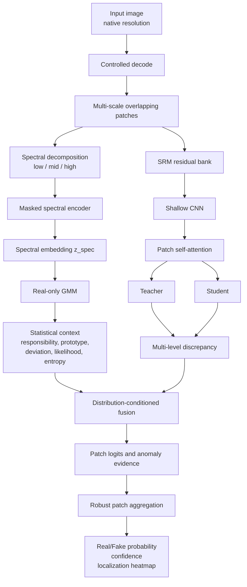

# D2-FAD

**Distribution-Conditioned Discrepancy Forensic Anomaly Detector**

Tài liệu này mô tả hướng nghiên cứu, kiến trúc, workflow huấn luyện và giao thức đánh giá cho model D2-FAD. Đây là thiết kế nghiên cứu mới được xây dựng từ các vấn đề quan sát được trong những thí nghiệm CLIP, NPR-ResNet18, AIDE Forensic và Full AIDE; không phải bản sao hoặc phép nối cơ học của một model có sẵn.

Thiết kế tensor, workflow chi tiết của từng nhánh và kích thước output được trình bày trong [ARCHITECTURE.md](./ARCHITECTURE.md).

## 1. Mục tiêu nghiên cứu

D2-FAD hướng tới phát hiện ảnh do AI tạo hoặc chỉnh sửa trong điều kiện:

- Generator ở test chưa xuất hiện khi train.
- Real và fake có nội dung tương đồng.
- Ảnh có thể là PNG, JPEG hoặc đã bị nén lại.
- Kích thước và tỉ lệ ảnh thay đổi.
- Ảnh có thể đã qua resize, crop, blur hoặc screenshot.
- Chỉ một vùng nhỏ trong ảnh bị sinh hoặc inpaint.

Câu hỏi nghiên cứu chính:

> Có thể dùng phân phối forensic của ảnh real để điều kiện hóa cách diễn giải teacher-student discrepancy, từ đó hạn chế semantic bias, codec bias và generator-specific bias hay không?

## 2. Động lực

Các thí nghiệm trước đây cho thấy ba nhóm vấn đề.

### 2.1 Semantic bias

- CLIP có thể đạt kết quả cao khi content distribution của real và fake khác nhau.
- Hiệu suất giảm mạnh trên các tập có content hoặc background được kiểm soát.
- Ảnh chỉ bị chỉnh sửa cục bộ khó phát hiện bằng semantic toàn ảnh.

### 2.2 Forensic preprocessing bias

- Model có thể học PNG/JPEG, chất lượng nén, kích thước hoặc lịch sử resize.
- Resize toàn ảnh có thể làm mất dấu vết low-level.
- Residual cố định như NPR có ích nhưng không đảm bảo tổng quát cho mọi generator.

### 2.3 Generator bias

- Binary classifier có thể học fingerprint của generator đã thấy.
- Hiệu suất trung bình có thể cao trong khi worst-generator rất thấp.
- Generator mới có thể để lại loại artifact khác hoàn toàn tập train.

Vì vậy, D2-FAD kết hợp hai loại bằng chứng:

1. **Real-manifold evidence:** sample phù hợp với phân phối forensic real nào và lệch khỏi phân phối đó ra sao.
2. **Discrepancy evidence:** teacher và student bất đồng như thế nào trên residual representation.

## 3. Nguồn cảm hứng

D2-FAD kế thừa ý tưởng, không sao chép nguyên kiến trúc, từ ba công trình:

- [SPAI — Any-Resolution AI-Generated Image Detection by Spectral Learning](https://openaccess.thecvf.com/content/CVPR2025/html/Karageorgiou_Any-Resolution_AI-Generated_Image_Detection_by_Spectral_Learning_CVPR_2025_paper.html): masked spectral learning và xử lý ảnh ở độ phân giải bất kỳ.
- [Beyond Generation](https://openaccess.thecvf.com/content/CVPR2025/html/Zhong_Beyond_Generation_A_Diffusion-based_Low-level_Feature_Extractor_for_Detecting_AI-generated_CVPR_2025_paper.html): low-level representation và one-class modeling bằng phân phối feature real.
- [GenDet](https://arxiv.org/abs/2312.08880): teacher-student discrepancy nhỏ với real, lớn với fake và generalized feature augmentation.

Điểm khác biệt của D2-FAD:

- Nhánh teacher-student nhận forensic residual thay vì phụ thuộc chủ yếu vào semantic feature.
- GMM không chỉ sinh một anomaly score mà tạo **statistical context token**.
- Statistical context của real được dùng để điều kiện hóa discrepancy.
- Dự đoán được thực hiện ở cấp patch và cấp ảnh để hỗ trợ chỉnh sửa cục bộ.

## 4. Tổng quan kiến trúc



## 5. Input và preprocessing

### 5.1 Nguyên tắc

- Không resize toàn ảnh về một kích thước vuông trước khi lấy patch.
- Decode ảnh theo một pipeline thống nhất.
- Lấy patch trên ảnh ở kích thước gốc.
- Chỉ pad khi ảnh nhỏ hoặc kích thước không phù hợp.
- Real và fake phải đi qua cùng một preprocessing pipeline.
- Không sử dụng filename, metadata hoặc đường dẫn làm input model.

### 5.2 Patch sampling ban đầu

Thông số khởi đầu đề xuất:

| Thành phần | Giá trị ban đầu |
|---|---:|
| Patch size nhỏ | 128 × 128 |
| Patch size lớn | 256 × 256 |
| Stride | 50% patch size |
| Số patch train | Cố định K patch/ảnh |
| Số patch inference | Tối đa K_max, lấy phủ đều ảnh |
| Padding | Reflect padding |

Số patch phải được chuẩn hóa hoặc mask trong aggregator để model không học kích thước ảnh thông qua số token.

## 6. Nhánh 1 — Spectral Real-Manifold Branch

### 6.1 Mục đích

Nhánh này học cấu trúc forensic phổ của ảnh real và trả lời:

- Sample gần mode real nào?
- Mức độ chắc chắn khi gán sample vào mode đó?
- Sample lệch khỏi prototype real theo hướng nào?
- Vùng phổ nào khó tái tạo?

### 6.2 Spectral representation

Các lựa chọn sẽ được kiểm chứng bằng ablation:

1. Local DCT với low/mid/high bands.
2. Haar Wavelet một hoặc nhiều level.
3. Local FFT với log-amplitude và phase-derived statistics.

Phiên bản đầu ưu tiên hai cấu hình:

- `DCT low/mid/high` để bám sát giả thuyết SPAI.
- `Haar Wavelet LL/LH/HL/HH` để giữ thông tin vị trí và đa tỉ lệ.

Không mặc định Wavelet, DCT hoặc FFT là tốt nhất trước khi có ablation.

### 6.3 Masked spectral reconstruction

Encoder chỉ nhìn thấy một phần spectral tokens và decoder khôi phục các token bị mask:

```text
spectral patches
→ mask random bands/tokens
→ encoder
→ lightweight decoder
→ reconstructed spectral tokens
```

Loss cơ bản:

```text
L_spec_rec = L1(X_hat_mask, X_mask)
             + lambda_cos * cosine_loss(X_hat_mask, X_mask)
```

Pretraining chính chỉ sử dụng ảnh real. Giả thuyết cần kiểm chứng là encoder được train trên real sẽ tạo representation và reconstruction pattern khác khi gặp fake. Không được mặc định rằng mọi fake luôn có reconstruction error cao hơn real.

### 6.4 Spectral embedding

Với patch `i`:

```text
z_spec_i = spectral_encoder(patch_i)
```

Embedding được LayerNorm và chiếu về một kích thước cố định, đề xuất ban đầu là 256 chiều.

### 6.5 Fit GMM trên real

Sau khi spectral encoder được train:

1. Freeze encoder.
2. Trích xuất embedding từ `real_train`.
3. Không dùng real validation hoặc test để fit.
4. Fit GMM với K component.
5. Chọn K bằng validation real likelihood và downstream ablation, không chỉ bằng train likelihood.

```text
p(z) = sum_k pi_k * Normal(z; mu_k, Sigma_k)
```

Khởi đầu với diagonal covariance và thử:

```text
K ∈ {4, 8, 16, 32}
```

Full covariance chỉ thử khi số sample đủ lớn và có regularization ổn định.

### 6.6 Statistical context token

Không dùng hard nearest-cluster làm feature duy nhất. Với embedding `z`, tính soft responsibility:

```text
r_k = p(k | z)
```

Prototype kỳ vọng:

```text
mu_bar    = sum_k r_k * mu_k
sigma_bar = sum_k r_k * sigma_k
```

Deviation chuẩn hóa:

```text
delta = (z - mu_bar) / (sigma_bar + eps)
```

Feature thống kê:

```text
f_gmm_raw = concat(
    responsibilities,
    delta,
    delta_squared,
    log_likelihood,
    responsibility_entropy,
    reconstruction_error
)
```

Không nhất thiết concat toàn bộ `mu` và `sigma` nếu làm dimension quá lớn. Chúng có thể được tóm tắt qua prototype projection.

Cuối cùng:

```text
gmm_token = LayerNorm(MLP_gmm(f_gmm_raw))  # 256-D
```

### 6.7 Quy tắc bất biến của GMM

Nếu spectral encoder thay đổi sau khi fit GMM thì embedding space cũng thay đổi. Khi đó GMM cũ không còn hợp lệ.

Chỉ được chọn một trong hai cách:

- Freeze spectral encoder sau khi fit GMM.
- Fine-tune encoder xong, trích xuất lại toàn bộ real embedding và fit lại GMM.

## 7. Nhánh 2 — Residual Teacher-Student Branch

### 7.1 Mục đích

Nhánh này học residual discrepancy và trả lời:

- Teacher và student có phản ứng giống nhau trên ảnh này không?
- Discrepancy nằm ở loại residual và patch nào?
- Discrepancy có giống các artifact đã thấy hay không?

### 7.2 SRM front-end

Phiên bản đầu sử dụng fixed SRM bank:

```text
RGB patch
→ 30 SRM filters
→ grouped/1×1 convolution
→ 32 hoặc 64 residual channels
```

Các ablation về sau:

- Fixed SRM.
- SRM initialization rồi fine-tune có ràng buộc.
- Learned constrained residual convolution.
- Không SRM, chỉ learned residual stem.

SRM là lựa chọn ban đầu để giảm semantic leakage, không phải thành phần bất biến của model.

### 7.3 CNN và self-attention

```text
SRM maps
→ shallow CNN stages
→ forensic patch tokens
→ 2–4 self-attention blocks
```

CNN học local residual pattern. Self-attention so sánh các vùng để tìm inconsistency giữa vùng nền và vùng được sinh hoặc chỉnh sửa.

Không sử dụng transformer quá lớn trong phiên bản đầu để hạn chế chi phí và giảm khả năng học semantic shortcut.

### 7.4 Teacher-student discrepancy

Teacher và student nhận cùng forensic representation:

```text
t = Teacher(f_residual)
s = Student(f_residual)
```

Multi-level discrepancy:

```text
d_raw = concat(
    abs(t - s),
    square(t - s),
    1 - cosine_similarity(t, s)
)
```

Sau projection:

```text
ts_token = LayerNorm(MLP_ts(d_raw))  # 256-D
```

### 7.5 Teacher-student objective

Với real, discrepancy cần nhỏ:

```text
L_real = mean(||T(x_real) - S(x_real)||^2)
```

Với fake, discrepancy cần lớn hơn margin:

```text
L_fake = mean(max(0, margin - ||T(x_fake) - S(x_fake)||))
```

Tổng:

```text
L_TS = L_real + lambda_fake * L_fake
```

GenDet còn sử dụng generalized feature augmentation. D2-FAD sẽ triển khai phần này sau khi baseline teacher-student ổn định:

- Perturb fake feature về phía real manifold.
- Interpolate feature giữa các generator.
- Tạo hard fake feature làm giảm discrepancy.
- Student phải duy trì khả năng tách các hard sample này.

### 7.6 Hạn chế generator fingerprint

SRM không tự động loại bỏ generator bias. Nhánh 2 cần:

- Paired real/fake content.
- Nhiều họ generator.
- Generator-balanced sampling.
- Leave-one-generator-family-out validation.
- Generator-adversarial head hoặc domain-generalization loss.

Gradient reversal có thể được dùng để làm representation khó dự đoán generator ID trong khi vẫn dự đoán real/fake được.

## 8. Fusion hai nhánh

### 8.1 Ý nghĩa

Hai token có vai trò khác nhau:

```text
gmm_token = bối cảnh và mức lệch khỏi phân phối real
ts_token  = bằng chứng teacher-student bất đồng trên residual
```

GMM không chỉ đóng vai trò classifier thứ nhất. Nó cung cấp mốc tham chiếu để model diễn giải residual discrepancy.

### 8.2 Fusion V1 — Concatenation baseline

```text
fusion = concat(gmm_token, ts_token)
logit  = MLP(fusion)
```

Đây là baseline đầu tiên để xác nhận hai nhánh có bổ sung nhau không.

### 8.3 Fusion V2 — Explicit interaction

```text
fusion = concat(
    gmm_token,
    ts_token,
    gmm_token * ts_token,
    abs(gmm_token - ts_token)
)
```

Sau đó:

```text
1024-D → 256-D → 64-D → 1 logit
```

V2 giúp classifier quan sát trực tiếp sự đồng thuận và mâu thuẫn giữa hai nhánh.

### 8.4 Fusion V3 — Distribution-conditioned discrepancy

GMM token sinh tham số scale và shift:

```text
gamma, beta = MLP_condition(gmm_token)
```

Điều chỉnh discrepancy:

```text
conditioned_ts = (1 + tanh(gamma)) * ts_token + beta
```

Dùng `1 + tanh(gamma)` để khởi đầu gần identity và tránh scale quá lớn trong giai đoạn đầu.

Ý nghĩa:

- Cùng một compression residual có thể bình thường với cluster JPEG nặng.
- Residual đó có thể bất thường với cluster PNG sạch.
- GMM context làm thay đổi mức quan trọng của từng chiều discrepancy.

### 8.5 Fusion V4 — Confidence-aware gate

Mỗi nhánh tạo một logit phụ:

```text
logit_gmm = Head_gmm(gmm_token)
logit_ts  = Head_ts(conditioned_ts)
```

Gate:

```text
gate = sigmoid(MLP_gate(concat(gmm_token, conditioned_ts)))
```

Logit cuối:

```text
logit_final = gate * logit_gmm + (1 - gate) * logit_ts
```

Phiên bản đầu nên dùng scalar gate để dễ giải thích. Vector gate chỉ thử trong ablation sau.

### 8.6 Thứ tự triển khai fusion

Không triển khai V4 ngay từ đầu. Thứ tự bắt buộc:

1. V1: concat baseline.
2. V2: thêm interaction.
3. V3: thêm distribution conditioning.
4. V4: thêm confidence gate.

Chỉ giữ phiên bản phức tạp hơn nếu cải thiện trên held-out generator và real cross-domain, không chỉ Tiny GenImage.

## 9. Patch aggregation

Mỗi patch sinh:

- `gmm_token_i`.
- `ts_token_i`.
- `patch_logit_i`.
- `patch_confidence_i`.

Không chỉ mean toàn bộ patch vì vùng fake nhỏ sẽ bị làm loãng.

Feature cấp ảnh đề xuất:

```text
image_evidence = concat(
    mean(patch_tokens),
    std(patch_tokens),
    max(patch_logits),
    mean(top_q_percent_patch_logits),
    robust_global_attention_token
)
```

Khởi đầu với `q = 20%`. Cần ablation `q ∈ {10%, 20%, 30%, 100%}`.

Output heatmap được dựng từ patch logits và vị trí patch. Heatmap chỉ có ý nghĩa localization nếu model không nhận tọa độ tuyệt đối có thể tạo shortcut.

## 10. Workflow train

### Phase 0 — Data audit và khóa split

Trước khi train:

- Kiểm tra trùng ảnh bằng hash và perceptual hash.
- Thống kê real/fake, generator, size, codec và source.
- Khóa manifest train/validation/test.
- Không thay manifest giữa các model ablation.
- Lưu SHA-256 của manifest.

### Phase 1 — Real-only spectral pretraining

Train:

- Spectral encoder.
- Lightweight reconstruction decoder.

Dữ liệu:

- Real train đa nguồn.
- Augmentation JPEG, PNG, resize, blur và noise được kiểm soát.

Checkpoint:

```text
checkpoints/phase1_spectral_encoder_best.pt
checkpoints/phase1_reconstruction_decoder_best.pt
```

### Phase 2 — GMM fitting

1. Freeze phase-1 encoder.
2. Extract real-train embeddings.
3. Fit và chọn GMM.
4. Đánh giá likelihood/FPR trên held-out real validation.

Artifacts:

```text
checkpoints/phase2_real_gmm.joblib
artifacts/real_embedding_statistics.json
artifacts/gmm_selection.csv
```

### Phase 3 — Teacher training

Train teacher bằng real/fake paired và bias-controlled data.

Điều kiện dữ liệu:

- Codec được cân bằng giữa nhãn.
- Resize và crop được áp dụng đối xứng.
- Content được ghép cặp khi có thể.
- Batch cân bằng theo generator.

Checkpoint:

```text
checkpoints/phase3_teacher_best.pt
```

### Phase 4 — Student discrepancy training

- Freeze hoặc EMA teacher.
- Train student match teacher trên real.
- Tăng discrepancy có margin trên fake.
- Thêm generalized feature augmentation sau khi baseline hội tụ.

Checkpoint:

```text
checkpoints/phase4_student_best.pt
checkpoints/phase4_feature_augmenter_best.pt
```

### Phase 5 — Fusion training

Ban đầu freeze:

- Spectral encoder.
- GMM.
- Residual encoder.
- Teacher.
- Student.

Chỉ train:

- GMM projection.
- TS projection.
- Conditioning module.
- Gate.
- Patch aggregator.
- Final classifier.

Dùng branch dropout:

- Xác suất nhỏ tắt GMM token.
- Xác suất nhỏ tắt TS token.
- Không tắt cả hai trong cùng sample.

Mục tiêu là ngăn classifier phụ thuộc tuyệt đối vào một nhánh.

Checkpoint:

```text
checkpoints/phase5_fusion_best.pt
checkpoints/d2_fad_complete_best.pt
```

### Phase 6 — Optional partial fine-tuning

Chỉ thực hiện sau khi phase 5 đã đánh giá đầy đủ.

Có thể mở:

- Block cuối của residual encoder.
- Block cuối của spectral encoder.
- Fusion modules.

Learning rate encoder phải nhỏ hơn fusion head. Nếu mở spectral encoder thì sau fine-tuning phải fit lại GMM trước khi đánh giá chính thức.

## 11. Loss tổng

Các loss không nhất thiết bật đồng thời từ epoch đầu:

```text
L_total =
    L_cls
    + lambda_aux_gmm * L_aux_gmm
    + lambda_aux_ts * L_aux_ts
    + lambda_ts * L_TS
    + lambda_spec * L_spec_rec
    + lambda_gen_adv * L_generator_adversarial
    + lambda_balance * L_branch_balance
```

Trong đó:

- `L_cls`: BCE hoặc focal loss cho final prediction.
- `L_aux_gmm`: auxiliary classification/calibration loss của nhánh GMM.
- `L_aux_ts`: auxiliary classification loss của nhánh discrepancy.
- `L_TS`: teacher-student discrepancy loss.
- `L_spec_rec`: masked spectral reconstruction loss.
- `L_generator_adversarial`: hạn chế generator identity leakage.
- `L_branch_balance`: hạn chế gate collapse vào một nhánh.

Không để reconstruction loss tiếp tục cập nhật spectral encoder sau khi GMM đã được cố định, trừ khi có quy trình refit GMM rõ ràng.

## 12. Dữ liệu train

### 12.1 Real data

Real train cần đa dạng:

- Camera photographs.
- Web images.
- JPEG nhiều mức chất lượng.
- PNG.
- Ảnh đã resize.
- Screenshot hoặc social-media recompression nếu có.
- Nhiều source dataset.

Không dùng test real của B-Free hoặc CommFor để mở rộng manifold train.

### 12.2 Fake data

Fake train cần bao phủ nhiều họ:

- GAN.
- Latent diffusion.
- Pixel-space diffusion.
- Flow-based generation.
- Autoregressive generation.
- Image-to-image reconstruction.
- Inpainting và localized editing.

Mục tiêu không chỉ tăng số ảnh mà tăng số họ generator và processing pipeline.

### 12.3 Symmetric post-processing

Trong cùng một batch, augmentation phải độc lập với nhãn:

```text
P(JPEG | real) = P(JPEG | fake)
P(resize | real) = P(resize | fake)
P(blur | real) = P(blur | fake)
```

Nếu real và fake có codec hoặc kích thước khác nhau một cách hệ thống, kết quả thí nghiệm không được coi là bằng chứng forensic đáng tin cậy.

## 13. Giao thức validation và test

### 13.1 Bộ test bắt buộc

| Benchmark | Vai trò |
|---|---|
| Tiny GenImage | So sánh với baseline cũ và kiểm tra in-domain |
| CommFor balanced 2000 | Đánh giá 10 generator và real đa dạng |
| B-Free T1–T6 | Content/background bias và localized generation |
| B-Free FLUX/SD3/LDM | Unseen generator |
| JPEG/PNG cases | Codec bias |
| Resize stress test | Resolution/resampling bias |
| Held-out real sources | False-positive cross-domain |

### 13.2 Leave-one-generator-family-out

Mỗi vòng giữ lại một họ generator hoàn toàn khỏi train. Báo cáo kết quả trên họ đó thay vì chỉ random split theo ảnh.

### 13.3 Leave-one-real-source-out

Giữ lại một real source khỏi train để đo liệu real manifold có xem source mới là fake hay không.

## 14. Metrics

### 14.1 Overall

- Accuracy.
- Balanced accuracy.
- ROC-AUC.
- Average precision.
- Fake precision, recall và F1.
- Confusion matrix.

### 14.2 Open-set và robustness

- Fake recall tại real FPR 1% và 5%.
- FPR@95%TPR.
- Worst-generator ROC-AUC.
- Macro-generator ROC-AUC/F1.
- Worst-real-source FPR.
- Hiệu suất sau JPEG/resize/blur.
- Mean và standard deviation giữa generator.

### 14.3 Bias probes

Train probe tuyến tính trên frozen representation để dự đoán:

- Content category.
- Dataset source.
- JPEG quality.
- Resolution bin.
- Generator identity.

Nếu các probe này đạt quá cao thì representation vẫn chứa shortcut mạnh.

### 14.4 Localization

Nếu benchmark có mask:

- Patch AUROC.
- Pixel/patch IoU.
- Localization average precision.
- Hiệu suất theo tỉ lệ diện tích fake.

## 15. Ablation plan

### 15.1 Nhánh spectral

| ID | Cấu hình |
|---|---|
| S0 | RGB reconstruction baseline |
| S1 | DCT low/mid/high |
| S2 | Haar Wavelet 1 level |
| S3 | Haar Wavelet multi-level |
| S4 | Local FFT |
| S5 | Không reconstruction, chỉ encoder |

### 15.2 GMM

| ID | Cấu hình |
|---|---|
| G0 | Chỉ negative log-likelihood |
| G1 | Hard nearest cluster + distance |
| G2 | Soft responsibility + deviation |
| G3 | Full statistical context token |
| G4 | GMM patch-level + image-level |

### 15.3 Residual branch

| ID | Cấu hình |
|---|---|
| R0 | RGB teacher-student |
| R1 | Fixed SRM |
| R2 | Trainable constrained SRM |
| R3 | Learned residual stem |
| R4 | SRM + CNN, không attention |
| R5 | SRM + CNN + attention |

### 15.4 Fusion

| ID | Cấu hình |
|---|---|
| F0 | Chỉ GMM branch |
| F1 | Chỉ teacher-student branch |
| F2 | Concatenation |
| F3 | Explicit interaction |
| F4 | Distribution conditioning |
| F5 | Conditioning + scalar gate |

## 16. Tiêu chí chọn model tốt nhất

Không chọn checkpoint chỉ bằng validation accuracy. Điểm tổng hợp đề xuất:

```text
selection_score =
    0.30 * macro_generator_auc
    + 0.25 * worst_generator_auc
    + 0.20 * recall_at_real_fpr_5
    + 0.15 * (1 - worst_real_source_fpr)
    + 0.10 * postprocessing_robustness
```

Trọng số chính thức phải được khóa trước khi chạy test cuối.

## 17. Cấu trúc thư mục dự kiến

```text
d2_fad/
├── README.md
├── configs/
│   ├── spectral_pretrain.yaml
│   ├── teacher_student.yaml
│   └── fusion.yaml
├── checkpoints/
├── artifacts/
├── metrics/
├── manifests/
├── src/
│   ├── spectral_branch.py
│   ├── residual_branch.py
│   ├── gmm_context.py
│   ├── fusion.py
│   ├── aggregation.py
│   └── model.py
├── train_spectral_modal.py
├── fit_real_gmm_modal.py
├── train_teacher_student_modal.py
├── train_fusion_modal.py
└── evaluate_d2_fad_modal.py
```

Hiện tại chỉ tạo tài liệu thiết kế. Source code và các thư mục con sẽ được tạo theo từng phase để tránh đưa vào repository các module chưa được kiểm chứng.

## 18. Artifacts và reproducibility

Mỗi run phải lưu:

- Config đầy đủ.
- Git commit hash.
- Random seed.
- Dataset manifest và SHA-256.
- Checkpoint hash.
- GMM parameters và encoder checkpoint tương ứng.
- Threshold trên validation real.
- Predictions từng sample.
- Metrics tổng quát và từng generator/source.
- Phiên bản thư viện.

Checkpoint GMM phải ghi rõ hash của spectral encoder dùng để tạo embedding. Loader phải từ chối chạy nếu hash không khớp.

## 19. Rủi ro nghiên cứu

### Reconstruction error không tách được real/fake

Fake mượt có thể dễ tái tạo hơn real nhiều texture. Vì vậy reconstruction error chỉ là một feature, không phải tiêu chí duy nhất.

### GMM xem real domain mới là anomaly

Cần real data đa nguồn, mixture components và held-out-real validation. Có thể phát triển conditional GMM theo nuisance domain nếu cần.

### Teacher-student học generator fingerprint

Cần đa dạng generator, paired data, generator-adversarial loss và leave-one-family-out evaluation.

### Fusion bỏ qua một nhánh

Dùng auxiliary heads, branch dropout, gate monitoring và ablation từng nhánh.

### Spectral encoder thay đổi làm GMM lỗi thời

Freeze encoder hoặc refit GMM sau fine-tuning. Luôn kiểm tra checkpoint hash.

### Codec invariance xóa forensic signal

Không ép invariance tuyệt đối. Nên học context/nuisance representation để điều kiện hóa quyết định thay vì xóa toàn bộ thông tin codec.

## 20. Điều kiện để chấp nhận giả thuyết

D2-FAD chỉ được coi là cải tiến thực sự nếu:

1. Tốt hơn từng nhánh riêng trên held-out generator.
2. Không tăng đáng kể false positive trên held-out real source.
3. Ổn định hơn baseline dưới JPEG và resize.
4. Cải thiện worst-generator, không chỉ average metric.
5. Có lợi trên B-Free origBG/localized cases.
6. GMM statistical context tốt hơn việc chỉ dùng một anomaly score.
7. Distribution conditioning tốt hơn concat dưới cùng protocol.

Nếu chỉ cải thiện Tiny GenImage nhưng giảm trên B-Free hoặc CommFor, giả thuyết fusion chưa được xác nhận.

## 21. Phiên bản MVP

Phiên bản đầu tiên cần đủ nhỏ để kiểm chứng nhanh:

```text
Branch 1:
    DCT low/mid/high
    → small spectral encoder
    → masked reconstruction trên real
    → 8-component diagonal GMM
    → soft responsibility + deviation + likelihood
    → 256-D token

Branch 2:
    fixed SRM
    → shallow ResNet18-style CNN
    → 2 attention blocks
    → teacher-student discrepancy
    → 256-D token

Fusion:
    explicit interaction V2
    → MLP classifier

Aggregation:
    mean + std + top-20% patch evidence
```

Sau khi MVP chạy ổn định mới thêm distribution conditioning V3 và confidence gate V4.
