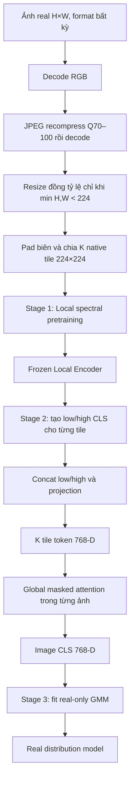
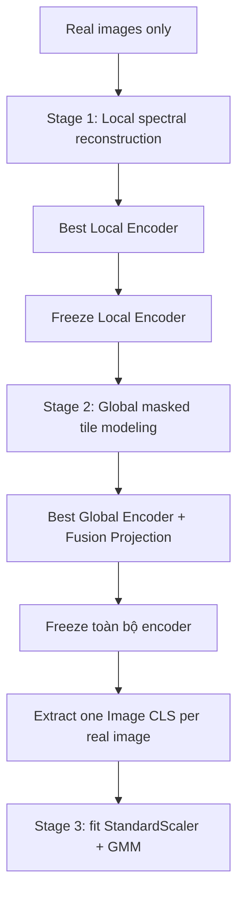

# Spectral-GMM Branch — Đặc tả kiến trúc và quy trình huấn luyện

> **SOURCE OF TRUTH:** Đây là đặc tả chuẩn dùng để triển khai và review code.
> Nếu code, notebook hoặc tài liệu khác mâu thuẫn với file này thì implementation
> đó được xem là sai và phải sửa theo file này. Không tự thay đổi workflow nếu
> chưa có xác nhận mới từ người thiết kế.

Trạng thái thiết kế: **đã khóa**. Không còn câu hỏi kiến trúc đang chờ xác nhận.

## 1. Mục tiêu

`Spectral-GMM Branch` là nhánh one-class học phân phối forensic của **ảnh real**.
Toàn bộ Stage 1, Stage 2 và bước fit GMM chỉ sử dụng ảnh real. Ảnh fake chỉ được
dùng khi đánh giá cuối cùng.

Mục tiêu của nhánh:

1. Học quan hệ giữa các token `16×16` nằm trong cùng một native tile `224×224`.
2. Học quan hệ giữa tất cả native tile thuộc cùng một ảnh.
3. Tạo đúng một vector `Image CLS 768-D` cho mỗi ảnh, không phụ thuộc kích thước
   ảnh hoặc số tile.
4. Fit GMM trên các `Image CLS` của ảnh real để mô hình hóa real distribution.

Hai khái niệm phải được phân biệt:

| Tên | Kích thước | Vai trò |
|---|---:|---|
| ViT token | `16×16` pixel | Đơn vị self-attention bên trong một local tile |
| Native tile | `224×224` pixel | Vùng lớn lấy trực tiếp từ ảnh, không resize nếu ảnh đủ lớn |

---

## 2. Quyết định thiết kế đã khóa

- Tile size cố định `224×224`.
- Stride cấu hình được; mặc định `224` nên không overlap.
- `stride < 224` tạo tile overlap.
- Ảnh đủ lớn không được resize hoặc random crop.
- Chỉ ảnh có cạnh nhỏ hơn 224 mới được resize đồng tỷ lệ.
- Phần biên thiếu được pad ở cạnh phải và cạnh dưới.
- 100% ảnh, bất kể format nguồn, được decode RGB rồi JPEG recompression với
  quality trong `[70, 100]` trước khi chia tile; không có raw/original view.
- Stage 1: mỗi tile ngẫu nhiên dùng một trong hai view low hoặc high.
- Stage 1 dùng tất cả tile nhưng mean loss trong từng ảnh để ảnh lớn không có
  trọng số cao hơn ảnh nhỏ.
- Stage 1 và Stage 2 được train riêng.
- Stage 2 freeze hoàn toàn Local Encoder.
- Stage 2 dùng cả `Local CLS low` và `Local CLS high` của mỗi tile.
- Low/high được concat và projection về đúng một global token cho mỗi tile.
- Global Attention chỉ diễn ra giữa các tile thuộc cùng một ảnh; không có
  attention giữa hai ảnh khác nhau trong minibatch.
- Ảnh có bao nhiêu tile thì Global Transformer nhận đủ bấy nhiêu tile; không
  truncate để tạo số tile cố định.
- Global reconstruction bắt buộc dùng `Image CLS bottleneck`.
- Ma trận contextual `K×768` là output trung gian; không đi trực tiếp vào
  reconstruction head và không đi vào GMM.
- GMM nhận đúng một `Image CLS 768-D` trên mỗi ảnh, không nhận từng tile vector
  và không nhận ma trận có số hàng thay đổi.
- Stage 1 train luôn dùng JPEG; quality/subsampling thay đổi xác định theo
  `sample_id + epoch + seed`.
- Validation, cache Stage 2, fit GMM, calibration và inference đều luôn dùng
  JPEG Q70–100 xác định theo `sample_id + seed`.

---

## 3. Workflow tổng quát



---

## 4. Xử lý kích thước ảnh và chia native tile

### 4.1 Ảnh nhỏ

Nếu `min(H, W) < 224`, ảnh được resize **đồng tỷ lệ**:

\[
s = \frac{224}{\min(H,W)}
\]

\[
H' = \operatorname{round}(sH),\qquad
W' = \operatorname{round}(sW)
\]

Ví dụ:

```text
100×400 → 224×896
100×100 → 224×224
```

Không kéo méo trực tiếp ảnh chữ nhật thành `224×224`.

### 4.2 Ảnh đủ lớn

Nếu cả hai cạnh đều từ 224 trở lên, giữ nguyên toàn bộ pixel và native scale.
Không dùng `Resize(256)`, `CenterCrop`, `RandomCrop` hoặc `RandomResizedCrop`.

### 4.3 Tile và stride

```text
tile_size = 224
stride = configurable
default stride = 224
```

- `stride=224`: tile không overlap.
- `stride=112`: overlap 50%.
- Cạnh phải và cạnh dưới được pad vừa đủ để tile cuối phủ hết ảnh.
- Mặc định dùng reflect-padding; nếu kích thước không hợp lệ cho reflect thì
  dùng replicate-padding.

Với một chiều dài `D`, số tile là:

\[
n(D)=
\max\left(
1,
\left\lceil\frac{D-224}{\text{stride}}\right\rceil+1
\right)
\]

Tổng số tile:

\[
K=n(H')n(W')
\]

Mỗi tile lưu tọa độ tâm 2-D đã normalize để tạo positional encoding ở Stage 2.

---

## 5. JPEG normalization bắt buộc

JPEG normalization được thực hiện ở **cấp ảnh trước khi chia tile**, không nén
riêng từng tile và không giữ nhánh raw/original.

```text
Ảnh đầu vào ở format bất kỳ
   → decode RGB
   → JPEG encode Q70–100, subsampling ∈ {0,1,2}
   → JPEG decode RGB
   → chia native tile
```

Nếu file ban đầu đã là JPEG thì vẫn decode rồi recompress lại. Nếu file ban đầu
là PNG hoặc format khác thì cũng đi đúng pipeline trên. Reconstruction target là
ảnh sau JPEG decode; model không phải khôi phục ngược về pixel trước JPEG.

Tất cả tile của cùng một ảnh dùng cùng một quality và subsampling.

### 5.1 Chính sách theo từng phase

| Phase | JPEG policy |
|---|---|
| Stage 1 train | 100% JPEG; Q70–100 và subsampling xác định theo `sample_id + epoch + seed` |
| Stage 1 validation | 100% JPEG; cố định theo `sample_id + seed` |
| Cache / Stage 2 train và validation | Chỉ `jpeg_low/jpeg_high` từ JPEG cố định theo `sample_id + seed` |
| Fit StandardScaler/GMM | Dùng đúng JPEG view đã cache |
| Calibration | Dùng đúng JPEG view đã cache |
| Inference | 100% JPEG; cố định theo `sample_id + seed` |

Hai lần validation/inference trên cùng input và checkpoint phải tạo cùng output.

---

## 6. Stage 1 — Local spectral pretraining

### 6.1 Mục tiêu

Stage 1 học attention giữa các token nhỏ nằm trong **một tile duy nhất**.

```text
Một native tile 224×224
        │
        ▼
Patch embedding 16×16
        │
        ▼
14×14 = 196 token
        │
        ▼
Local ViT Self-Attention
```

Không có attention giữa hai tile và không có attention giữa hai ảnh ở Stage 1.

### 6.2 Tạo spectral view

Với tile gốc sau augmentation:

\[
x_{b,i}\in\mathbb{R}^{3\times224\times224}
\]

trong đó `b` là ảnh và `i` là tile của ảnh đó.

Tính FFT:

\[
X_{b,i}=\operatorname{FFT2}(x_{b,i})
\]

Mỗi lần tile xuất hiện trong train, random đúng một view:

\[
r_{b,i}\sim\operatorname{Bernoulli}(0.5)
\]

```text
r = 0 → giữ low frequency
r = 1 → giữ high frequency
```

Input encoder:

\[
\tilde{x}_{b,i}=
\operatorname{IFFT2}(M_{r_{b,i}}\odot X_{b,i})
\]

Target luôn là tile `x_{b,i}` trước khi frequency mask.

### 6.3 Local Encoder và Local Decoder

```text
Input:             3×224×224 spectral view
Patch embedding:   16×16
Token grid:        196 token
Hidden dimension:  768
Backbone:          ViT-B/16

Encoder output:
  - spatial tokens: [196, 768]
  - Local CLS:      [768]

Decoder output:
  - reconstructed tile: [3, 224, 224]
```

Spatial token được decoder dùng để tái tạo tile. Local CLS được giữ làm tile
representation cho Stage 2.

### 6.4 Loss theo tile, ảnh và batch

Loss tile chỉ tính trên phần phổ đã bị bỏ:

\[
L_{b,i}=D_{\mathrm{freq}}
\left(x_{b,i},\hat{x}_{b,i};1-M_{r_{b,i}}\right)
\]

Ảnh có `K_b` tile được mean loss trong chính ảnh đó:

\[
L_{\mathrm{image},b}
=
\frac{1}{K_b}
\sum_{i=1}^{K_b}L_{b,i}
\]

Batch có `B` ảnh:

\[
L_{\mathrm{local}}
=
\frac{1}{B}
\sum_{b=1}^{B}L_{\mathrm{image},b}
\]

Nhờ đó ảnh 25 tile và ảnh 1 tile có cùng trọng số cấp ảnh.

Implementation có thể micro-batch các tile để tránh OOM, nhưng chỉ được
`optimizer.step()` sau khi đã tích lũy đúng mean loss theo ảnh/batch.

### 6.5 Validation Stage 1

Validation sử dụng cùng native tiling với train:

- Không resize ảnh đủ lớn.
- Không center crop.
- Không random crop.
- Mỗi validation tile chạy cả low và high để metric ổn định.

Phải báo cáo:

```text
validation_jpeg_low_loss
validation_jpeg_high_loss
validation_jpeg_mean_loss

validation_primary_loss = validation_jpeg_mean_loss
```

Early stopping dùng `validation_primary_loss`. JPEG validation được sinh xác
định bằng seed nên metric không thay đổi ngẫu nhiên giữa các epoch.

### 6.6 Thành phần train và artifact

```text
Train:
  - Local ViT Encoder
  - Local Reconstruction Decoder

Data:
  - Real only

Checkpoint:
  - stage1_local_last.pt
  - stage1_local_best.pt
  - stage1_local_encoder_best.pt

Metrics:
  - stage1_training_history.csv
```

Checkpoint phải được lưu sau mỗi epoch để resume.

---

## 7. Stage 2 — Global masked tile modeling

### 7.1 Đóng băng Local Encoder

Sau Stage 1:

```text
Freeze:
  - Local ViT Encoder

Không dùng tiếp:
  - Local Reconstruction Decoder
```

Local Encoder đóng vai trò teacher cố định tạo target. Gradient Stage 2 không
được cập nhật Local Encoder.

### 7.2 Hai Local CLS cho mỗi tile

Khác Stage 1, Stage 2 luôn chạy **cả low và high** cho mỗi tile:

```text
Tile i
  ├── low view  → Frozen Local Encoder → z_low_i  [768]
  └── high view → Frozen Local Encoder → z_high_i [768]
```

### 7.3 Ý nghĩa của normalize low/high

Normalize ở đây chỉ tác động lên vector feature, không resize hoặc thay đổi ảnh.

Mục đích:

- Không để nhánh có vector magnitude lớn hơn lấn át nhánh còn lại.
- Cho low và high đóng góp cân bằng khi concat.
- Ổn định target của masked feature reconstruction.

Baseline dùng chuẩn hóa L2 cố định:

\[
\bar z_{\mathrm{low},i}=
\frac{z_{\mathrm{low},i}}
{\|z_{\mathrm{low},i}\|_2+\epsilon}
\]

\[
\bar z_{\mathrm{high},i}=
\frac{z_{\mathrm{high},i}}
{\|z_{\mathrm{high},i}\|_2+\epsilon}
\]

### 7.4 Fusion low/high thành một tile token

Concat hai frozen target:

\[
u_i=
[\bar z_{\mathrm{low},i};\bar z_{\mathrm{high},i}]
\in\mathbb{R}^{1536}
\]

Projection trainable:

```text
u_i [1536]
  → Linear 1536→768
  → GELU
  → LayerNorm
  → tile token t_i [768]
```

Mỗi native tile vẫn tạo đúng **một** token cho Global Transformer.

### 7.5 Sequence cấp ảnh

Ảnh `b` có `K_b` tile:

\[
T_b=[t_1,t_2,\ldots,t_{K_b}]
\in\mathbb{R}^{K_b\times768}
\]

Cộng positional encoding theo tọa độ tâm tile và thêm learned Image CLS:

```text
[IMAGE_CLS, t1+pos1, t2+pos2, ..., tK+posK]
```

Ảnh trong cùng minibatch được pad ở cấp sequence. Attention mask đảm bảo:

- Tile thật chỉ attention với tile thật của cùng ảnh.
- Không attention vào sequence padding.
- Không attention giữa hai ảnh khác nhau.

### 7.6 Masked tile modeling

Mask ngẫu nhiên một tỷ lệ tile, mặc định:

```text
global_mask_ratio = 0.40
```

Toàn bộ fused token của tile được thay bằng learned `MASK` token. Không mask
riêng low hoặc high vì low/high đã được fusion thành một đơn vị tile.

### 7.7 Hai loại output của Global Transformer

Global Transformer tạo hai output có vai trò khác nhau:

Với sequence đầu vào:

\[
S_b=[c_{\mathrm{img}},t_1+p_1,\ldots,t_{K_b}+p_{K_b}]
\in\mathbb{R}^{(K_b+1)\times768}
\]

Global Transformer trả về:

\[
O_b=G(S_b)\in\mathbb{R}^{(K_b+1)\times768}
\]

Tách output:

\[
z_{\mathrm{img},b}=\operatorname{LN}(O_b[0])\in\mathbb{R}^{768}
\]

\[
H_b=O_b[1:K_b+1]\in\mathbb{R}^{K_b\times768}
\]

```text
Contextual tile matrix H: [K, 768]
  - representation trung gian sau attention giữa các tile
  - K thay đổi theo ảnh
  - không đưa trực tiếp vào prediction head của phiên bản chính
  - KHÔNG fit trực tiếp vào GMM

Image CLS z_img: [768]
  - vector cố định đại diện toàn ảnh
  - một vector trên mỗi ảnh
  - input bắt buộc của Global Reconstruction Decoder
  - đây là input duy nhất của GMM
```

### 7.8 Buộc Image CLS thực sự chứa thông tin toàn ảnh

Nếu decoder chỉ dùng từng contextual tile output, Image CLS có thể bị bỏ qua.
Phiên bản chính **bắt buộc** dùng Image CLS bottleneck:

```text
Global Transformer
      │
      ├── contextual tile matrix H
      └── Image CLS z_img [768]
                    │
                    ▼
       z_img + positional query của tile bị mask
                    │
                    ▼
            Global Reconstruction Decoder
                 ├── Low prediction head  → zhat_low_i  [768]
                 └── High prediction head → zhat_high_i [768]
```

Target là hai feature cố định từ Frozen Local Encoder:

```text
target_low_i  = stop_gradient(normalized z_low_i)
target_high_i = stop_gradient(normalized z_high_i)
```

Thiết kế này ngăn projection/Global Transformer collapse về vector hằng số và
buộc `Image CLS` nhận gradient từ nhiệm vụ reconstruction.

Không dùng thiết kế BERT chuẩn `H_i → prediction head` trong phiên bản chính.
Nguyên lý che và dự đoán vẫn giống BERT, nhưng prediction được ép đi qua một
global bottleneck để vector đưa vào GMM thật sự đại diện toàn ảnh.

### 7.9 Global loss

Với tập tile bị mask `M_b` trong ảnh `b`:

\[
L_{\mathrm{low},b}=
\frac{1}{|M_b|}
\sum_{i\in M_b}
\|\hat z_{\mathrm{low},i}-\bar z_{\mathrm{low},i}\|_2^2
\]

\[
L_{\mathrm{high},b}=
\frac{1}{|M_b|}
\sum_{i\in M_b}
\|\hat z_{\mathrm{high},i}-\bar z_{\mathrm{high},i}\|_2^2
\]

\[
L_{\mathrm{global},b}
=
\frac{1}{2}L_{\mathrm{low},b}
+
\frac{1}{2}L_{\mathrm{high},b}
\]

Loss batch mean theo ảnh:

\[
L_{\mathrm{global}}
=
\frac{1}{B}
\sum_{b=1}^{B}L_{\mathrm{global},b}
\]

Baseline đầu tiên chỉ dùng normalized MSE. Cosine loss là ablation sau, không
trộn thêm vào baseline trước khi kiểm chứng.

### 7.10 Thành phần train và artifact

```text
Train:
  - Low/high fusion projection 1536→768
  - Global Transformer
  - Image CLS token
  - MASK token
  - Global Reconstruction Decoder
  - Low prediction head
  - High prediction head

Freeze:
  - Local Encoder
  - Local Decoder

Data:
  - Real only

Checkpoint:
  - stage2_global_last.pt
  - stage2_global_best.pt

Metrics:
  - stage2_training_history.csv
```

---

## 8. Stage 3 — Fit real-only GMM

### 8.1 Trích representation cấp ảnh

Khi trích feature cho GMM:

- Không mask tile.
- Không đổi JPEG realization ngẫu nhiên; dùng đúng seeded JPEG view đã cache.
- Mỗi tile chạy cả low và high.
- Low/high được normalize, concat và projection giống Stage 2.
- Global Transformer nhận toàn bộ K tile token.
- Lấy `output[0]`, qua final LayerNorm, tạo đúng một `Image CLS 768-D`.

```text
Ảnh b
  → K native tile
  → K cặp z_low/z_high
  → K fused tile token
  → Global Transformer
  → z_img_b [768]
```

Không mean các `Image CLS low/high` riêng và không fit GMM trên ma trận
`K×768`. Low/high đã được fusion ở cấp tile trước Global Attention.

Nếu batch có `B` ảnh, output chuyển sang GMM có shape:

\[
Z_{\mathrm{img}}\in\mathbb{R}^{B\times768}
\]

Không flatten, mean hoặc concat ma trận contextual `H` vào `Z_img`.

### 8.2 Fit GMM

Tập embedding real train:

\[
Z_{\mathrm{real}}=
\{z_{\mathrm{img}}^{(1)},\ldots,z_{\mathrm{img}}^{(N)}\}
\]

Mỗi phần tử tương ứng đúng một ảnh.

```text
Image CLS real train
   → StandardScaler fit trên real train
   → GMM diagonal covariance
```

Với thống kê StandardScaler chỉ từ real train:

\[
\tilde z_j=
\frac{z_j-\mu_j^{\mathrm{train}}}
{\sigma_j^{\mathrm{train}}+\epsilon}
\]

GMM nhận `z_tilde [768]`. Baseline không dùng PCA và không L2-normalize lại
`Image CLS` sau Global Transformer; phép chuẩn hóa trước GMM là StandardScaler.

Candidate số component:

```text
M ∈ {1, 2, 4, 8, 16}
```

Quy tắc:

- GMM chỉ fit bằng real train.
- Real validation dùng chọn số component bằng likelihood/BIC/occupancy.
- Real calibration dùng đặt anomaly threshold.
- Không dùng fake để chọn GMM hoặc threshold one-class chính.

Artifacts:

```text
stage3_real_feature_scaler.joblib
stage3_real_distribution_gmm.joblib
stage3_gmm_component_statistics.npz
stage3_real_only_thresholds.json
```

---

## 9. Output của nhánh và inference

Với ảnh cần kiểm tra:

```text
Ảnh bất kỳ
  → resize chỉ khi cạnh nhỏ hơn 224
  → native tiling
  → frozen Local Encoder low/high
  → frozen fusion projection
  → frozen Global Transformer
  → một Image CLS 768-D
  → real-only GMM
```

GMM tính:

\[
p(z)=\sum_{m=1}^{M}\pi_m
\mathcal{N}(z\mid\mu_m,\Sigma_m)
\]

Nhánh trả về:

```text
image_cls                [768]
negative_log_likelihood  [1]
responsibilities         [M]
nearest_component_mean   [768]
nearest_component_std    [768]
normalized_residual      [768]
responsibility_entropy   [1]
```

Trong đó:

\[
m^*=\arg\max_m p(m\mid z)
\]

\[
\delta=
\frac{z-\mu_{m^*}}{\sigma_{m^*}+\epsilon}
\]

NLL có thể dùng làm anomaly score độc lập. Các statistic đầy đủ được giữ lại để
sau này fusion với nhánh thứ hai; chúng không thay thế `Image CLS` trong GMM.

---

## 10. Quy trình train tách giai đoạn



| Stage | Đơn vị train | Attention | Thành phần cập nhật | Output |
|---|---|---|---|---|
| Stage 1 | Tất cả native tile, mean loss/ảnh | Giữa 196 token trong một tile | Local Encoder + Local Decoder | Local Encoder |
| Stage 2 | Toàn bộ tile của từng ảnh | Giữa các tile trong cùng ảnh | Fusion + Global Transformer + Decoder | Image Encoder |
| Stage 3 | Một Image CLS trên mỗi ảnh | Không backprop | Fit scaler và GMM | Real distribution |

Không train end-to-end trong phiên bản đầu. Mọi joint fine-tuning là ablation
sau khi ba stage độc lập đã chạy đúng.

---

## 11. Dataset protocol

Nguồn train chính:

```text
ImageNet-1K real train
1.000 synset
100 ảnh ngẫu nhiên/synset
100.000 ảnh real
```

Split trong từng synset:

```text
80 ảnh Stage 1/Stage 2 train
10 ảnh validation
10 ảnh calibration GMM threshold
```

Nhãn lớp ImageNet không được đưa vào model. Synset chỉ dùng để sampling cân bằng.

Manifest phải lưu:

```text
sample_id
relative_path
synset
split
sampling_seed
```

---

## 12. Cấu hình baseline đã thống nhất

```yaml
image:
  small_image_resize: preserve_aspect_ratio
  jpeg_policy: all_images_decode_rgb_then_jpeg
  jpeg_quality_min: 70
  jpeg_quality_max: 100
  validation_jpeg: deterministic_by_sample_id_and_seed
  gmm_feature_jpeg: deterministic_by_sample_id_and_seed
  inference_jpeg: deterministic_by_sample_id_and_seed

tiling:
  tile_size: 224
  stride: 224
  border_padding: reflect
  fallback_padding: replicate
  use_all_tiles: true

local_encoder:
  architecture: vit_base_patch16_224
  token_size: 16
  token_count_per_tile: 196
  embedding_dim: 768
  frequency_view: random_low_or_high
  low_probability: 0.50
  loss_reduction: mean_per_image_then_mean_batch

global_encoder:
  low_feature_dim: 768
  high_feature_dim: 768
  concat_dim: 1536
  tile_token_dim: 768
  feature_normalization: l2_per_branch
  fusion: linear_gelu_layernorm
  mask_ratio: 0.40
  positional_encoding: continuous_2d
  attention_scope: within_image_only
  output_image_cls_dim: 768
  image_cls_bottleneck: true
  contextual_tile_output_to_prediction_head: false

global_loss:
  target: frozen_normalized_low_and_high_cls
  low_weight: 0.50
  high_weight: 0.50
  objective: normalized_mse
  reduction: mean_per_image_then_mean_batch

gmm:
  input: image_cls_768
  components: [1, 2, 4, 8, 16]
  covariance_type: diag
  reg_covar: 1.0e-6
```

---

## 13. Logging, checkpoint và kiểm tra bắt buộc

### Stage 1

Log phải cho biết:

```text
epoch
images completed / total images
tiles completed / total tiles
train low loss
train high loss
train image-mean loss
validation low loss
validation high loss
validation mean loss
learning rate
speed
ETA
```

Kiểm tra:

- Không có `RandomResizedCrop` đối với ảnh đủ lớn.
- Một ảnh nhiều tile không được tăng trọng số loss.
- Local CLS không collapse: kiểm tra variance và effective rank.
- Reconstruction output có cùng kích thước tile `224×224`.

### Stage 2

Log phải cho biết:

```text
images completed
total real tile tokens
mean/min/max K
masked tile count
low reconstruction loss
high reconstruction loss
global mean loss
```

Kiểm tra:

- Local Encoder thật sự frozen.
- Low/high target có `stop_gradient`.
- Attention mask chặn sequence padding và ảnh khác.
- Mỗi ảnh tạo đúng một Image CLS.
- Image CLS không collapse.
- Prediction head chỉ nhận Image CLS và positional query, không nhận trực tiếp
  contextual row của tile bị mask.

### GMM

Kiểm tra:

- Số input vector bằng số ảnh, không bằng số tile.
- Không có NaN/Inf.
- Component occupancy không collapse.
- Lưu hash của Local Encoder, fusion projection và Global Encoder.

---

## 14. Những điều không được làm

- Không resize toàn bộ ảnh đủ lớn về `224×224`.
- Không dùng `RandomResizedCrop` hoặc `CenterCrop` thay cho native tiling.
- Không trộn tile của nhiều ảnh thành một attention sequence.
- Không fit GMM trực tiếp trên từng tile.
- Không fit GMM trên ma trận `K×768` có K thay đổi.
- Không mean trực tiếp `z_low` và `z_high` trước Global Attention.
- Không dùng trực tiếp contextual tile row để dự đoán masked target trong phiên
  bản Image CLS bottleneck chính.
- Không update Local Encoder trong Stage 2 baseline.
- Không dùng raw/original view khi train, fit GMM, calibration hoặc inference.
- Không đổi JPEG realization khi fit GMM/calibration; dùng đúng seeded view.
- Không dùng fake để chọn checkpoint, số component hoặc threshold one-class.

---

## 15. Workflow cuối cùng

```text
STAGE 1 — LOCAL TOKEN ATTENTION
Real image
  → mandatory whole-image JPEG Q70–100 recompression
  → native tiling 224×224, configurable stride
  → mỗi tile random low hoặc high
  → 196 token 16×16
  → Local ViT self-attention trong tile
  → reconstruct tile
  → masked frequency loss
  → mean tile loss trong ảnh
  → Frozen Local Encoder

STAGE 2 — GLOBAL TILE ATTENTION
Real image
  → cùng native tiling
  → mỗi tile chạy cả low và high
  → Frozen Local Encoder
  → normalized z_low [768] + z_high [768]
  → concat [1536]
  → projection thành một tile token [768]
  → dùng toàn bộ K tile token của ảnh
  → mask một số tile token
  → Global Transformer attention trong cùng ảnh
  → contextual matrix K×768 chỉ dùng làm representation trung gian
  → Image CLS bottleneck 768-D
  → Image CLS + positional query dự đoán frozen low/high CLS của tile bị mask
  → Frozen Global Image Encoder

STAGE 3 — REAL DISTRIBUTION
Mỗi real image
  → không random augmentation
  → Global output[0] + final LayerNorm
  → một Image CLS [768]
  → StandardScaler
  → real-only GMM

INFERENCE
Unknown image
  → một Image CLS [768]
  → GMM posterior, NLL, component mean/std và residual
  → real/anomaly decision hoặc fusion với nhánh thứ hai
```
