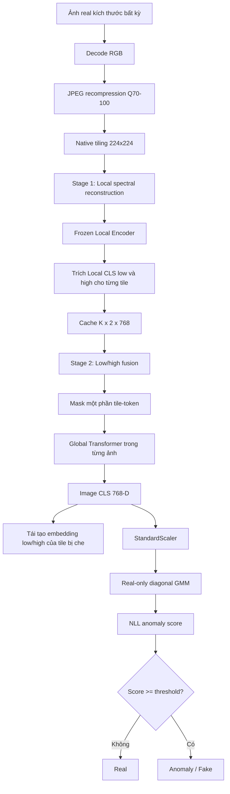

# Spectral-GMM Branch — Kiến trúc và workflow thực nghiệm

## 1. Mục tiêu

Spectral-GMM là mô hình phát hiện ảnh sinh theo hướng **one-class anomaly detection**.
Mô hình chỉ học phân phối forensic của ảnh real và xem ảnh có xác suất thấp dưới
phân phối này là bất thường.

Giả thuyết nghiên cứu:

> Quan hệ giữa thành phần tần số thấp và cao của ảnh real có cấu trúc ổn định.
> Một biểu diễn được học bằng tái tạo phổ cục bộ và mô hình hóa quan hệ toàn ảnh
> sẽ giúp GMM nhận ra ảnh nằm ngoài phân phối real mà không cần học dấu vết của
> từng generator.

Ảnh fake không được dùng để train Stage 1, train Stage 2, fit GMM hoặc hiệu chỉnh
ngưỡng one-class. TinyGenImage chỉ dùng để đánh giá sau cùng.

## 2. Dữ liệu

Nguồn huấn luyện là ImageNet real, lấy cố định 100 ảnh từ mỗi 1.000 synset:

| Split | Ảnh/synset | Tổng ảnh | Vai trò |
|---|---:|---:|---|
| `real_train` | 80 | 80.000 | Train Stage 1, Stage 2 và fit scaler/GMM |
| `real_validation` | 10 | 10.000 | Chọn checkpoint và số cụm GMM |
| `real_calibration` | 10 | 10.000 | Tạo ngưỡng q90, q95, q99 |

Manifest, seed và phép chia được giữ cố định giữa các stage. TinyGenImage không
tham gia bất kỳ bước cập nhật trọng số nào.

## 3. Workflow tổng quát



Ba stage được train tuần tự, không end-to-end:

1. Train Local Encoder bằng tái tạo phổ.
2. Đóng băng Local Encoder, train Global Transformer.
3. Đóng băng toàn bộ neural network, fit StandardScaler và GMM.

## 4. Tiền xử lý chung

Mọi ảnh, bất kể định dạng nguồn, đều đi qua cùng pipeline:

```text
File ảnh
  → decode RGB
  → encode JPEG với quality ngẫu nhiên Q70–100 và subsampling {0,1,2}
  → decode JPEG
  → chia native tile 224×224
```

- Ảnh có hai chiều từ 224 trở lên không bị resize toàn ảnh.
- Nếu cạnh ngắn nhỏ hơn 224, ảnh được resize giữ tỉ lệ để cạnh ngắn bằng 224.
- Phần biên thiếu được pad; stride mặc định là 224 và có thể điều chỉnh.
- Mỗi tile lưu tọa độ tâm 2-D chuẩn hóa để dùng làm positional encoding.
- Stage 1 train đổi JPEG realization theo ảnh và epoch.
- Validation, cache, GMM và inference dùng JPEG realization xác định bởi seed và
  `sample_id`, nhờ đó có thể tái lập kết quả.

Mục đích của JPEG normalization là giảm shortcut do PNG/JPEG, quality và
subsampling khác nhau giữa real và fake.

## 5. Stage 1 — Local spectral reconstruction

### 5.1 Input và spectral view

Với mỗi tile gốc `x ∈ R^(3×224×224)`, code tính FFT 2-D và ngẫu nhiên chọn một
trong hai view:

- `low`: giữ vùng tần số thấp trong mặt nạ bán kính 16;
- `high`: giữ phần bù của mặt nạ, tức vùng tần số cao.

Sau inverse FFT, view phổ được chuẩn hóa theo ImageNet rồi đưa vào Local MFM.
Target tái tạo luôn là tile RGB gốc.

### 5.2 Local MFM

```text
Spectral tile [3,224,224]
  → ViT-B/16
  → 196 patch tokens + 1 Local CLS, mỗi token 768-D
  → reshape 196 spatial tokens thành [768,14,14]
  → convolution + PixelShuffle
  → reconstructed tile [3,224,224]
```

Self-attention ở Stage 1 chỉ diễn ra giữa 196 token thuộc **cùng một tile**.
Không có attention giữa các tile hoặc giữa các ảnh.

### 5.3 Loss Stage 1

Loss được tính trong miền Fourier và chỉ trên phần phổ đã bị loại khỏi input:

```math
L_{tile}=\frac{\sum |\mathcal{F}(\hat{x})-\mathcal{F}(x)|\,(1-M)}
{\sum(1-M)}
```

Với ảnh có `K` tile:

```math
L_{image}=\frac{1}{K}\sum_{i=1}^{K}L_{tile,i}
```

Sau đó lấy trung bình theo ảnh trong batch. Vì vậy ảnh độ phân giải lớn có nhiều
tile không được nhận trọng số lớn hơn ảnh nhỏ.

Output cần giữ sau Stage 1 là **Local Encoder tốt nhất**. Decoder chỉ phục vụ
pretraining và không đi vào GMM.

## 6. Cache đặc trưng giữa hai stage

Local Encoder được đóng băng. Với mỗi tile, hệ thống chạy cả hai view:

```text
low spectral tile  → Local Encoder → Local CLS low  [768]
high spectral tile → Local Encoder → Local CLS high [768]
```

Một ảnh có `K` tile tạo cache:

```text
features  : [K, 2, 768]
positions : [K, 2]
```

Cache chỉ là tối ưu I/O và tốc độ. Nó không phải một mô hình và không có loss.

## 7. Stage 2 — Global Image-CLS bottleneck

### 7.1 Low/high fusion

Với mỗi tile:

```text
L2Norm(CLS_low [768]) || L2Norm(CLS_high [768])
  → concat [1536]
  → Linear + GELU + LayerNorm
  → fused tile token [768]
```

Positional encoding 2-D được cộng vào token. Khoảng 40% tile-token của từng ảnh
được thay bằng một learnable mask token.

### 7.2 Global Transformer

```text
[Image CLS] + K fused tile tokens
  → Transformer Encoder, depth=4, heads=12
  → Image CLS [768] + contextual tokens [K,768]
```

Attention chỉ diễn ra giữa các tile của **cùng một ảnh**. Các ảnh có số tile
khác nhau được padding và dùng validity mask; batch còn bị giới hạn theo tổng số
token để kiểm soát bộ nhớ.

### 7.3 Image-CLS reconstruction bottleneck

Decoder không nhận trực tiếp contextual token. Memory duy nhất của decoder là
`Image CLS [768]`. Từ Image CLS và `K` positional query, decoder phải dự đoán lại:

```text
predicted CLS_low  [K,768]
predicted CLS_high [K,768]
```

Loss chỉ tính trên các tile đã bị mask:

```math
L_{stage2}=\frac{1}{2}(L_{low}+L_{high})
```

trong đó mỗi thành phần là MSE giữa embedding dự đoán và Local CLS target đã
L2-normalize, được mean theo tile bị mask rồi mean theo ảnh.

Thiết kế bottleneck này buộc một vector Image CLS cố định phải chứa thông tin
toàn ảnh, thay vì chỉ lấy mean tùy ý từ số lượng tile khác nhau.

## 8. Stage 3 — Real-only GMM

Khi trích đặc trưng cho GMM, Stage 2 chạy không mask và trả về đúng một vector:

```text
z = Image CLS ∈ R^768
```

Quy trình fit:

1. Fit `StandardScaler` trên 80.000 vector `real_train`.
2. Fit các diagonal GMM với số cụm `{1, 2, 4, 8, 16}` trên `real_train`.
3. Loại mô hình không hội tụ hoặc có cụm occupancy quá nhỏ.
4. Chọn GMM có log-likelihood cao nhất trên `real_validation`.
5. Tính NLL trên `real_calibration` và lưu các quantile q90, q95, q99.

Anomaly score của ảnh `x` là:

```math
s(x)=-\log p(\operatorname{StandardScaler}(z(x))\mid GMM)
```

Quy tắc dự đoán:

```text
score < threshold  → real
score ≥ threshold  → anomaly/fake
```

`q95` là operating point chính: theo tập real calibration, khoảng 95% ảnh real
có score thấp hơn ngưỡng này. Đây không phải ngưỡng tối ưu cân bằng real/fake.

## 9. Đánh giá trên TinyGenImage

TinyGenImage chỉ dùng sau khi Stage 2 và GMM đã hoàn thành:

```text
Tiny image
  → cùng JPEG Q70–100 và native tiling
  → frozen Local Encoder
  → frozen Global Transformer
  → Image CLS 768-D
  → scaler + GMM
  → NLL score
```

Báo cáo gồm ROC-AUC, AP, confusion matrix, balanced accuracy, real/fake recall,
metric từng generator và mức chồng lấp hai phân phối score.

Hai nhóm ngưỡng phải được phân biệt rõ:

- `q90/q95/q99`: lấy hoàn toàn từ ImageNet real calibration, hợp lệ cho đánh
  giá one-class;
- `Tiny oracle threshold`: dùng nhãn Tiny để tối đa balanced accuracy, chỉ đo
  khả năng phân tách và **không được xem là ngưỡng triển khai**.

## 10. Checkpoint và artifact chính

| Artifact | Ý nghĩa |
|---|---|
| `stage1_local_encoder_best.pt` | Local Encoder tốt nhất, đầu vào của Stage 2 |
| `stage2_global_best.pt` | Global Transformer tốt nhất |
| `stage2_global_last.pt` | Trạng thái resume Stage 2 |
| `stage3_real_feature_scaler.joblib` | StandardScaler fit trên real train |
| `stage3_real_distribution_gmm.joblib` | GMM được chọn bằng real validation |
| `stage3_real_only_thresholds.json` | Ngưỡng q90/q95/q99 |
| `tiny_predictions.csv` | NLL score và dự đoán từng ảnh test |

Notebook tiếp tục từ Stage 1 hiện tại là
`train_stage2_gmm_from_stage1_best_kaggle.ipynb`. Nó chỉ chạy:

```text
cache → Stage 2 → GMM → Tiny diagnostic
```

Checkpoint Stage 1 đang dùng là `stage1_local_encoder_best.pt` tại epoch hoàn
tất tốt nhất; Stage 1 không được train lại trong notebook này.

## 11. Các nguyên tắc không được thay đổi khi báo cáo

- Không mô tả mô hình là supervised real/fake classifier.
- Không nói GMM được fit bằng ảnh fake hoặc TinyGenImage.
- Không nói GMM nhận từng tile; nó nhận một Image CLS 768-D trên mỗi ảnh.
- Không nói Stage 2 tái tạo ảnh RGB; nó tái tạo embedding low/high của tile.
- Không nói mọi ảnh bị resize 224×224; ảnh lớn được native tiling.
- Không dùng Tiny oracle threshold như kết quả one-class công bằng.
- Không gọi Stage 1 là bản sao chính xác của SPAI; đây là thiết kế lấy cảm hứng
  từ masked frequency reconstruction và đã được điều chỉnh cho workflow hiện tại.
